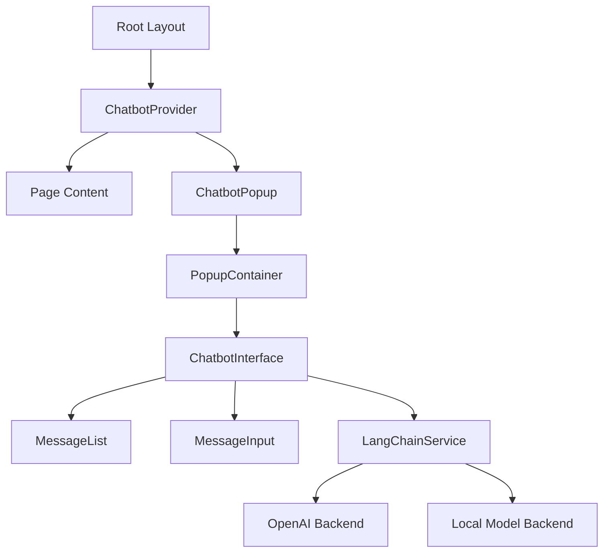

# Design Document: Chatbot Popup Interface

## Overview

This design document outlines the architecture and implementation approach for a persistent chatbot interface system built with React, Next.js, TypeScript, and LangChain. The system consists of a popup container component that slides up from the bottom of the screen and contains a chatbot interface with full conversation capabilities, tool calling support, and state persistence across navigation.

The design leverages Next.js App Router for application-level integration, React hooks for state management, browser localStorage for persistence, and LangChain for flexible LLM backend integration.

## Architecture

### High-Level Component Structure



### Component Hierarchy

1. **ChatbotProvider** (Context Provider)
   - Manages global chatbot state
   - Provides state and actions to child components
   - Handles state persistence to localStorage
   - Mounted at root layout level

2. **ChatbotPopup** (Container Component)
   - Manages popup visibility and minimize state
   - Handles animations and positioning
   - Renders PopupContainer with ChatbotInterface

3. **PopupContainer** (UI Component)
   - Provides visual container with header and minimize button
   - Handles expand/collapse animations
   - Manages responsive sizing

4. **ChatbotInterface** (Main Component)
   - Orchestrates message flow
   - Integrates with LangChainService
   - Manages conversation state
   - Handles tool calling UI

5. **MessageList** (Display Component)
   - Renders conversation history
   - Auto-scrolls to latest message
   - Displays loading and tool execution states

6. **MessageInput** (Input Component)
   - Handles user text input
   - Manages send button and keyboard events
   - Provides input validation

7. **LangChainService** (Service Layer)
   - Abstracts LangChain integration
   - Manages backend configuration
   - Handles streaming responses
   - Executes tool calls

## Components and Interfaces

### 1. ChatbotProvider

**Purpose**: Global state management and persistence

**Props**:
```typescript
interface ChatbotProviderProps {
  children: React.ReactNode;
  config: ChatbotConfig;
}
```

**State**:
```typescript
interface ChatbotState {
  messages: Message[];
  isMinimized: boolean;
  isOpen: boolean;
  isLoading: boolean;
  currentToolCall: ToolCall | null;
}
```

**Key Methods**:
- `addMessage(message: Message): void`
- `toggleMinimize(): void`
- `toggleOpen(): void`
- `setLoading(loading: boolean): void`
- `setToolCall(toolCall: ToolCall | null): void`

**Persistence Strategy**:
- Save state to localStorage on every state change
- Restore state on mount
- Use debouncing to optimize localStorage writes
- Store key: `chatbot-state`

### 2. ChatbotPopup

**Purpose**: Main popup container with animations

**Props**:
```typescript
interface ChatbotPopupProps {
  // No props - consumes context
}
```

**Styling**:
- Fixed positioning: `bottom-0 right-4`
- Z-index: `z-50` (above most content)
- Animations: slide-up on open, slide-down on close
- Responsive width: `w-96 max-w-[calc(100vw-2rem)]`
- Max height: `max-h-[80vh]`

### 3. PopupContainer

**Purpose**: Visual container with header and controls

**Props**:
```typescript
interface PopupContainerProps {
  isMinimized: boolean;
  onMinimize: () => void;
  children: React.ReactNode;
}
```

**Layout**:
- Header with title and minimize button
- Content area (conditionally rendered based on minimize state)
- Shadow and border styling
- Rounded corners

### 4. ChatbotInterface

**Purpose**: Core chatbot functionality

**Props**:
```typescript
interface ChatbotInterfaceProps {
  // No props - consumes context and uses LangChainService
}
```

**Key Responsibilities**:
- Initialize LangChainService with config
- Handle message submission
- Process streaming responses
- Execute tool calls
- Display errors

**Message Flow**:
1. User submits message
2. Add user message to state
3. Set loading state
4. Call LangChainService.sendMessage()
5. Handle streaming response chunks
6. Handle tool calls if invoked
7. Add assistant response to state
8. Clear loading state

### 5. MessageList

**Purpose**: Display conversation history

**Props**:
```typescript
interface MessageListProps {
  messages: Message[];
  isLoading: boolean;
  currentToolCall: ToolCall | null;
}
```

**Features**:
- Auto-scroll to bottom on new messages
- Distinct styling for user vs assistant messages
- Timestamp display
- Tool call indicators
- Loading spinner
- Error message display

### 6. MessageInput

**Purpose**: User input handling

**Props**:
```typescript
interface MessageInputProps {
  onSend: (message: string) => void;
  disabled: boolean;
}
```

**Features**:
- Textarea with auto-resize
- Send button
- Enter key to send (Shift+Enter for new line)
- Disabled state during loading
- Input validation (non-empty)

### 7. LangChainService

**Purpose**: LangChain integration layer

**Interface**:
```typescript
class LangChainService {
  constructor(config: ChatbotConfig);
  
  async sendMessage(
    message: string,
    history: Message[],
    onStream?: (chunk: string) => void
  ): Promise<string>;
  
  async executeToolCall(
    toolName: string,
    parameters: Record<string, any>
  ): Promise<any>;
  
  private initializeChain(): void;
  private createMemory(history: Message[]): BufferMemory;
}
```

**Backend Support**:
- OpenAI: Use `ChatOpenAI` from LangChain
- Local models: Use `ChatOllama` or custom integration
- Configuration-driven initialization

## Data Models

### Message

```typescript
interface Message {
  id: string;
  role: 'user' | 'assistant' | 'system' | 'tool';
  content: string;
  timestamp: number;
  toolCall?: ToolCall;
  error?: string;
}
```

### ChatbotConfig

```typescript
interface ChatbotConfig {
  backend: 'openai' | 'local';
  apiKey?: string; // For OpenAI
  modelName: string;
  baseUrl?: string; // For local models
  temperature?: number;
  tools?: ToolDefinition[];
  systemPrompt?: string;
}
```

### ToolDefinition

```typescript
interface ToolDefinition {
  name: string;
  description: string;
  parameters: {
    type: 'object';
    properties: Record<string, {
      type: string;
      description: string;
      enum?: string[];
    }>;
    required: string[];
  };
  execute: (params: Record<string, any>) => Promise<any>;
}
```

### ToolCall

```typescript
interface ToolCall {
  id: string;
  name: string;
  parameters: Record<string, any>;
  result?: any;
  error?: string;
  status: 'pending' | 'executing' | 'completed' | 'failed';
}
```

### ChatbotState (Persisted)

```typescript
interface PersistedChatbotState {
  messages: Message[];
  isMinimized: boolean;
  isOpen: boolean;
  version: string; // For migration support
}
```

## Error Handling

### Error Categories

1. **Configuration Errors**
   - Invalid API key
   - Missing required config fields
   - Unsupported backend type
   - **Handling**: Display error in chat, prevent initialization

2. **Network Errors**
   - API request failures
   - Timeout errors
   - Connection issues
   - **Handling**: Display retry option, log error

3. **Tool Execution Errors**
   - Tool function throws error
   - Invalid parameters
   - Tool not found
   - **Handling**: Display error message, continue conversation

4. **Streaming Errors**
   - Stream interruption
   - Malformed chunks
   - **Handling**: Display partial response, mark as incomplete

### Error Display Strategy

- Show errors inline in message list
- Use distinct error styling (red background, icon)
- Provide actionable error messages
- Include retry buttons where appropriate
- Log errors to console for debugging

## Testing Strategy

### Unit Tests

1. **ChatbotProvider**
   - State management functions
   - localStorage persistence
   - State restoration

2. **LangChainService**
   - Backend initialization
   - Message sending
   - Tool execution
   - Error handling

3. **Message Components**
   - Message rendering
   - Timestamp formatting
   - Tool call display

### Integration Tests

1. **Message Flow**
   - User sends message → assistant responds
   - Streaming response handling
   - Tool call execution flow

2. **State Persistence**
   - Save state on navigation
   - Restore state on mount
   - Handle corrupted localStorage data

3. **Responsive Behavior**
   - Mobile layout
   - Minimize/expand transitions
   - Scroll behavior

### E2E Tests (Optional)

1. **Full Conversation Flow**
   - Open chatbot
   - Send multiple messages
   - Navigate between pages
   - Verify persistence

2. **Tool Calling**
   - Trigger tool call
   - Verify execution
   - Check result display

## Implementation Notes

### Next.js Integration

- Mount ChatbotProvider in `app/layout.tsx`
- Use client components (`'use client'`) for interactive parts
- Leverage Next.js App Router for navigation persistence
- Use React Server Components where possible for static parts

### Styling Approach

- Use Tailwind CSS (already in project)
- Create custom animations for slide-up/down
- Use CSS transitions for smooth minimize/expand
- Ensure mobile-first responsive design

### Performance Considerations

- Debounce localStorage writes (300ms)
- Virtualize message list for long conversations (optional)
- Lazy load LangChain dependencies
- Memoize expensive computations
- Use React.memo for message components

### Accessibility

- Keyboard navigation support
- ARIA labels for buttons and inputs
- Focus management for popup
- Screen reader announcements for new messages
- Sufficient color contrast

### Security

- Sanitize user input before display
- Validate tool parameters
- Store API keys securely (environment variables)
- Implement rate limiting for message sending
- Validate localStorage data on restore

## Dependencies

### Required Packages

```json
{
  "langchain": "^0.3.0",
  "@langchain/openai": "^0.3.0",
  "@langchain/community": "^0.3.0",
  "framer-motion": "^11.0.0" // For animations (optional)
}
```

### Optional Packages

- `@langchain/ollama`: For local model support
- `react-markdown`: For rendering markdown in messages
- `date-fns`: For timestamp formatting

## Migration and Versioning

### localStorage Version Management

- Include version field in persisted state
- Implement migration functions for breaking changes
- Clear invalid/old state gracefully
- Default to empty state if migration fails

### Configuration Updates

- Support backward-compatible config changes
- Provide sensible defaults for new config options
- Validate config on initialization

## Future Enhancements

1. **Voice Input**: Add speech-to-text support
2. **File Attachments**: Allow users to upload files
3. **Multi-language**: Support i18n for UI text
4. **Themes**: Light/dark mode support
5. **Analytics**: Track usage metrics
6. **Export**: Allow users to export conversation history
7. **Suggestions**: Show quick reply suggestions
8. **Typing Indicators**: Show when bot is "typing"
