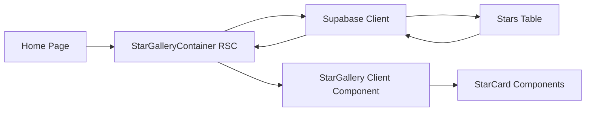

# Design Document

## Overview

The Star Gallery feature will integrate Supabase database connectivity with a horizontally scrollable React component system to display star information on the home page. The implementation leverages Next.js 16 App Router with React Server Components for data fetching, React Suspense for loading states, and Tailwind CSS for styling with a dark space theme.

The system consists of three main layers:
1. **Data Layer**: Supabase client and TypeScript interfaces for type-safe database queries
2. **Component Layer**: Reusable React components (Star Card and Star Gallery)
3. **Integration Layer**: Server Components that fetch data and compose the UI

## Architecture

### Technology Stack
- **Framework**: Next.js 16 (App Router with React Server Components)
- **Database**: Supabase (PostgreSQL)
- **Styling**: Tailwind CSS v4
- **Language**: TypeScript 5
- **React**: v19.2.0

### Component Hierarchy

```
app/page.tsx (Home Page)
├── GalaxyAnimation (existing)
├── Logo (existing)
└── StarGalleryContainer (new - Server Component)
    └── Suspense
        └── StarGallery (new - Client Component)
            └── StarCard[] (new - Client Component)
```

### Data Flow



## Components and Interfaces

### 1. Supabase Client Configuration

**Location**: `lib/supabase/client.ts`

**Purpose**: Provide a configured Supabase client for server-side and client-side usage

**Interface**:
```typescript
// Environment variables needed
NEXT_PUBLIC_SUPABASE_URL=<supabase-project-url>
NEXT_PUBLIC_SUPABASE_ANON_KEY=<supabase-anon-key>

// Client factory functions
export function createServerClient(): SupabaseClient
export function createBrowserClient(): SupabaseClient
```

**Design Decisions**:
- Use `@supabase/ssr` package for Next.js App Router compatibility
- Separate server and browser clients for proper cookie handling
- Environment variables prefixed with `NEXT_PUBLIC_` for client-side access

### 2. Data Models

**Location**: `lib/supabase/types.ts`

**Star Interface**:
```typescript
export interface Star {
  id: string;
  name: string;
  photo_url: string;
  description: string;
  distance_light_years: number;
  constellation: string;
  magnitude: number;
  created_at: string;
}
```

**Design Decisions**:
- Use snake_case for database column names (PostgreSQL convention)
- Use camelCase for TypeScript interfaces (JavaScript convention)
- Include created_at for potential sorting/filtering
- All fields required except where explicitly optional

### 3. Data Access Layer

**Location**: `lib/supabase/stars.ts`

**Purpose**: Encapsulate all Stars table queries

**Interface**:
```typescript
export async function getStars(): Promise<Star[]>
export async function getStarById(id: string): Promise<Star | null>
```

**Design Decisions**:
- Server-side only functions (not exported to client)
- Return typed data with proper error handling
- Use Supabase query builder for type safety

### 4. StarCard Component

**Location**: `app/_components/StarCard.tsx`

**Purpose**: Display a single star's information with photo and details

**Props Interface**:
```typescript
interface StarCardProps {
  star: Star;
  scale: number; // 0.8 to 1.2 for size variation based on position
  className?: string;
}
```

**Visual Design**:
- Dark card background with subtle gradient (space theme)
- Star photo at top with aspect ratio 16:9
- Star name in prominent typography
- Key details (constellation, distance, magnitude) in grid layout
- Smooth scale transitions via CSS transforms
- Border glow effect using box-shadow with blue/purple hues

**Styling Approach**:
```css
/* Color palette (space theme) */
--card-bg: rgba(10, 10, 30, 0.8)
--card-border: rgba(100, 100, 255, 0.3)
--card-glow: rgba(150, 150, 255, 0.5)
--text-primary: #ededed
--text-secondary: #a0a0c0
--accent: #6366f1 (indigo)
```

### 5. StarGallery Component

**Location**: `app/_components/StarGallery.tsx`

**Purpose**: Horizontally scrollable container for Star Cards with center-focus scaling

**Props Interface**:
```typescript
interface StarGalleryProps {
  stars: Star[];
}
```

**Behavior**:
- Horizontal scroll with hidden scrollbar (overflow-x: auto, scrollbar-width: none)
- Snap scrolling for smooth card-to-card navigation (scroll-snap-type: x mandatory)
- Center card scales to 1.2x, adjacent cards scale to 1.0x, others to 0.8x
- Use IntersectionObserver API to detect center card
- Smooth transitions for scale changes (transition: transform 0.3s ease)

**Layout**:
- Flexbox with horizontal direction
- Gap between cards: 2rem
- Padding on sides to allow centering of first/last cards
- Cards centered vertically in container

**Scroll Mechanics**:
```typescript
// Pseudo-code for center detection
useEffect(() => {
  const observer = new IntersectionObserver(
    (entries) => {
      entries.forEach(entry => {
        const scale = calculateScale(entry.intersectionRatio, entry.boundingClientRect);
        updateCardScale(entry.target, scale);
      });
    },
    { threshold: [0, 0.25, 0.5, 0.75, 1], root: scrollContainer }
  );
}, []);
```

### 6. StarGalleryContainer Component

**Location**: `app/_components/StarGalleryContainer.tsx`

**Purpose**: Server Component that fetches data and wraps StarGallery with Suspense

**Implementation**:
```typescript
export default async function StarGalleryContainer() {
  const stars = await getStars();
  
  return (
    <Suspense fallback={<StarGalleryLoading />}>
      <StarGallery stars={stars} />
    </Suspense>
  );
}
```

**Design Decisions**:
- Async Server Component for data fetching
- Suspense boundary for loading states
- Error boundary handling via error.tsx

### 7. Loading Component

**Location**: `app/_components/StarGalleryLoading.tsx`

**Purpose**: Loading skeleton for Suspense fallback

**Visual Design**:
- Horizontal row of 3-4 skeleton cards
- Pulsing animation
- Matches StarCard dimensions
- Space-themed shimmer effect

## Error Handling

### Database Connection Errors
- Catch Supabase client initialization errors
- Display user-friendly message: "Unable to connect to star database"
- Log detailed error to console for debugging

### Query Errors
- Catch query failures in getStars()
- Return empty array with error logged
- Display "No stars available" message in UI

### Empty Results
- Handle zero stars gracefully
- Display message: "No stars to display yet"
- Provide visual consistency with empty state

### Network Errors
- Leverage Next.js error boundaries
- Create error.tsx in app directory for global error handling
- Retry mechanism for transient failures

## Testing Strategy

### Unit Tests
- Test Star data model validation
- Test scale calculation logic for center detection
- Test Supabase client configuration

### Component Tests
- Test StarCard renders with all star properties
- Test StarCard scales correctly based on scale prop
- Test StarGallery renders multiple cards
- Test StarGallery scroll behavior

### Integration Tests
- Test data fetching from Supabase
- Test Server Component data passing to Client Component
- Test Suspense loading states
- Test error boundaries

### Manual Testing
- Verify horizontal scroll works without page scroll
- Verify center card scales larger
- Verify smooth transitions between cards
- Verify dark theme consistency
- Test on different viewport sizes
- Test with varying numbers of stars (0, 1, 5, 20+)

## Performance Considerations

### Image Optimization
- Use Next.js Image component for star photos
- Lazy load images outside viewport
- Optimize image sizes (WebP format, responsive sizes)

### Data Fetching
- Server-side data fetching for initial load
- Consider caching strategy (Next.js cache, Supabase cache)
- Implement pagination if star count grows large

### Scroll Performance
- Use CSS transforms for scaling (GPU accelerated)
- Debounce scroll event handlers
- Use will-change CSS property for animated elements
- Limit IntersectionObserver threshold points

### Bundle Size
- Tree-shake Supabase client (only import needed functions)
- Code-split StarGallery as client component
- Minimize CSS with Tailwind purge

## Accessibility

### Keyboard Navigation
- Ensure gallery is keyboard navigable (tab, arrow keys)
- Focus indicators on cards
- Skip link to bypass gallery if needed

### Screen Readers
- Semantic HTML (article for cards, section for gallery)
- Alt text for star photos
- ARIA labels for scroll container
- Announce loading states

### Visual Accessibility
- Sufficient color contrast (WCAG AA minimum)
- Focus visible indicators
- Reduced motion support for scale animations

## Future Enhancements

- Click to expand star details in modal
- Filter/search stars by constellation
- Favorite stars functionality
- Infinite scroll for large datasets
- Share individual star cards
